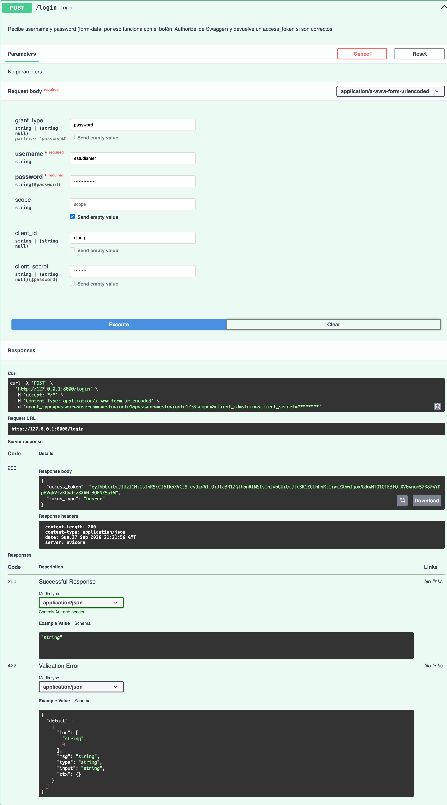
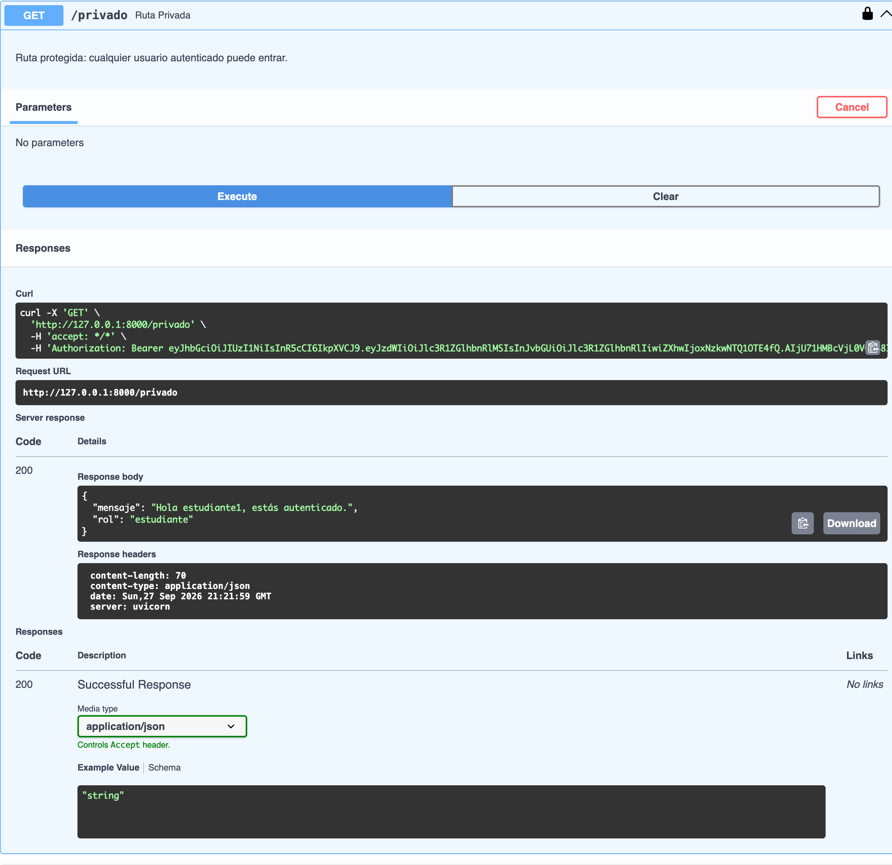
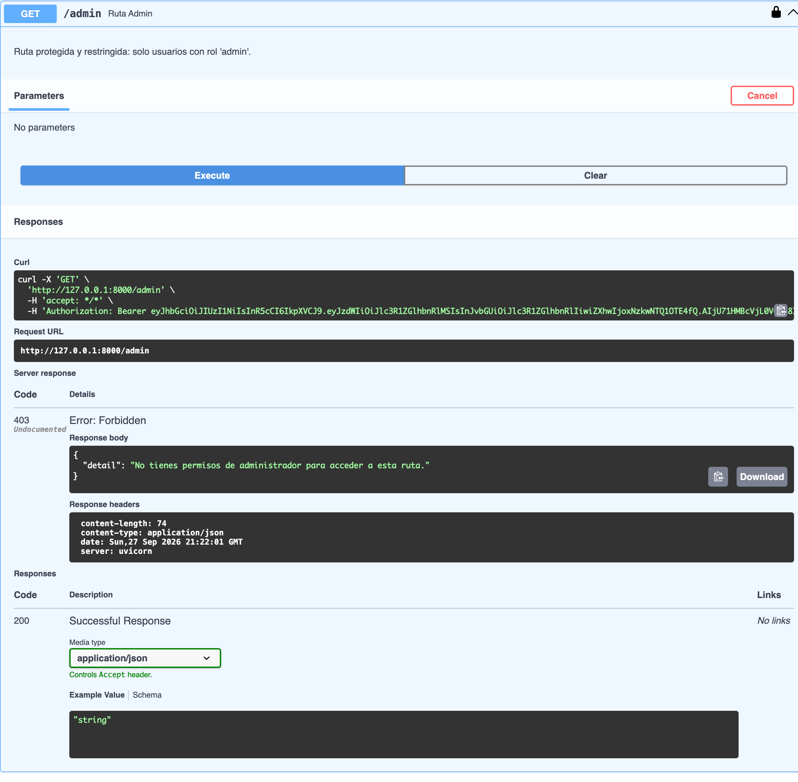

# Actividad Clase Sábado 26/09/2026 — Unidad IV

**Materia:** Lenguaje de Programación (20262CR-LPR07304-MG)
**Sección:** 307C1
**Alumno:** Steven Alcalá
**Cédula:** 31.542.054
**Fecha de entrega:** domingo 27/09/2026, 23:59

---

## PARTE A — Conceptual (40%)

### P1. ¿Qué significa JWT y cuáles son sus tres partes?

JWT son las siglas de **JSON Web Token**: un estándar abierto (RFC 7519) para
transmitir información entre dos partes de forma compacta y verificable,
codificada como un objeto JSON. Un JWT tiene tres partes separadas por
puntos (`xxxxx.yyyyy.zzzzz`):

1. **Header** — indica el tipo de token (`JWT`) y el algoritmo de firma
   usado (por ejemplo `HS256`).
2. **Payload** — contiene los *claims*, es decir los datos que viajan en el
   token (usuario, rol, fecha de expiración `exp`, etc.).
3. **Signature** — la firma. Se calcula tomando el header y el payload
   codificados, y firmándolos con el `SECRET_KEY` usando el algoritmo
   indicado en el header. Es lo que garantiza que el token no fue alterado.

### P2. ¿Por qué el payload NO es seguro para guardar contraseñas?

Porque el payload solo está **codificado en Base64, no encriptado**.
Base64 es reversible: cualquiera que tenga el token puede copiarlo, pegarlo
en un decodificador (por ejemplo jwt.io) y leer su contenido en texto
plano al instante, sin necesitar el `SECRET_KEY`. El `SECRET_KEY` solo
protege la *firma* (evita que alguien modifique o falsifique el token),
pero no oculta el contenido del payload. Por eso nunca debe guardarse ahí
una contraseña ni ningún dato sensible sin cifrar.

### P3. ¿Qué sucede si alguien modifica el payload sin conocer el SECRET_KEY?

El token deja de ser válido. La firma (`Signature`) se generó originalmente
a partir del header + payload *originales* usando el `SECRET_KEY`. Si
alguien cambia el payload (por ejemplo, para subir su propio `role` a
`"admin"`), la firma ya no corresponde a ese nuevo contenido. Cuando el
servidor recibe el token, vuelve a calcular la firma con su `SECRET_KEY`
sobre el payload recibido y la compara con la firma que venía en el
token: como no coinciden, `jwt.decode()` lanza una excepción
(`JWTError`) y el servidor rechaza el token con **401 Unauthorized**. Sin
conocer el `SECRET_KEY` es computacionalmente inviable generar una firma
válida para el payload modificado.

### P4. Diferencia entre 401 Unauthorized y 403 Forbidden. ¿Cuándo usa cada uno FastAPI?

- **401 Unauthorized** — el servidor no sabe quién eres, o tus
  credenciales son inválidas: no enviaste token, el token está mal
  formado, expiró, o la firma no coincide. Es un problema de
  **autenticación**.
- **403 Forbidden** — el servidor SÍ sabe quién eres (tu token es válido),
  pero no tienes permiso para hacer esa acción o acceder a ese recurso.
  Es un problema de **autorización**.

En este proyecto: `get_current_user()` (en `auth.py`) lanza **401** cuando
el token falta, es inválido o expiró. El endpoint `GET /admin` (en
`main.py`), una vez que el usuario ya fue autenticado correctamente,
lanza **403** si su `role` no es `"admin"`.

---

## PARTE B — Práctica (60%)

### Estructura del proyecto

```
.
├── auth.py           # hash_password, verify_password, create_token, get_current_user
├── main.py            # POST /login, GET /publico, GET /privado, GET /admin
├── requirements.txt
└── README.md
```

### `auth.py`

- `hash_password(password)` / `verify_password(plain, hashed)` — usan
  `passlib.CryptContext` con `bcrypt` para hashear y verificar contraseñas.
- `create_token(data, expires_delta=None)` — genera un JWT firmado con
  `python-jose`, incluyendo automáticamente el claim `exp`.
- `get_current_user(token)` — dependencia de FastAPI que decodifica el
  token del header `Authorization: Bearer <token>`, valida la firma y
  expiración, y devuelve el usuario. Lanza 401 si algo falla.
- Incluye una "base de datos" en memoria (`fake_users_db`) con dos
  usuarios de prueba (ver abajo), ya que la actividad no pide persistencia
  en base de datos.

### `main.py`

| Endpoint         | Método | Protección                       | Descripción                          |
|------------------|--------|-----------------------------------|---------------------------------------|
| `/login`         | POST   | Ninguna                           | Recibe `username`/`password`, devuelve `access_token` |
| `/publico`       | GET    | Ninguna                           | Accesible sin autenticarse           |
| `/privado`       | GET    | `Depends(get_current_user)`       | Requiere JWT válido, cualquier rol    |
| `/admin`         | GET    | `Depends(get_current_user)` + rol | Requiere JWT válido **y** `role == "admin"` (403 si no) |

### Usuarios de prueba

| Usuario        | Contraseña       | Rol         |
|-----------------|------------------|-------------|
| `admin`         | `admin123`       | `admin`     |
| `estudiante1`    | `estudiante123`  | `estudiante`|

### Cómo ejecutar

```bash
python3 -m venv venv
source venv/bin/activate          # Windows: venv\Scripts\activate
pip install -r requirements.txt
uvicorn main:app --reload
```

Con el servidor corriendo, la documentación interactiva de Swagger queda
en: **http://127.0.0.1:8000/docs**

### Flujo de prueba en Swagger

1. `POST /login` con `estudiante1` / `estudiante123` → copiar el
   `access_token` de la respuesta.
2. Click en **Authorize** (arriba a la derecha) → pegar el token → Authorize.
3. `GET /privado` → responde **200**, autenticado.
4. `GET /admin` → responde **403**, porque `estudiante1` no es admin.
5. (Opcional) repetir login con `admin` / `admin123` y volver a autorizar
   → `GET /admin` ahora responde **200**.

---

## Capturas (Swagger)

> *(Pegar aquí las 3 imágenes PNG pedidas en la actividad)*

**1. `POST /login` → 200 con token**



**2. `GET /privado` → 200 (autenticado)**



**3. `GET /admin` → 403 (rol estudiante)**



---

## Repositorio

> *(Pegar aquí el link del repositorio de GitHub)*

`https://github.com/tu-usuario/actividad-unidad-iv-lpr07304`
